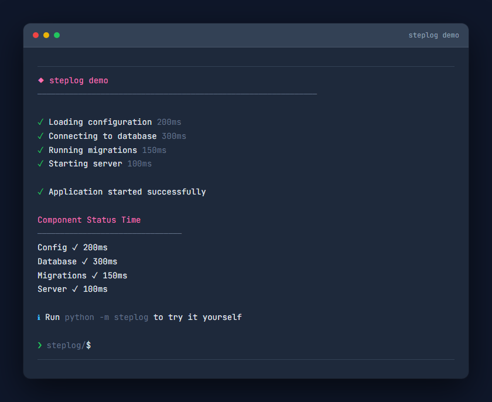
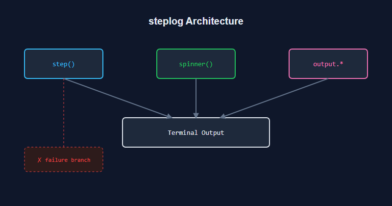

# steplog

<p align="center">
  
</p>

<p align="center">
  <strong>Beautiful CLI output for Python scripts.</strong><br>
  Steps, spinners, tables — zero dependencies.
</p>

<p align="center">
  <a href="https://github.com/ZachDreamZ/steplog/actions/workflows/ci.yml"></a>
  <a href="https://github.com/ZachDreamZ/steplog/blob/master/LICENSE"></a>
  
  
  
</p>

---

```
❯ steplog — beautiful CLI output for Python scripts

  A lightweight library for adding structured, colored output to your
  CLI scripts. Steps with timing. Spinners for long operations. Tables
  for structured data. No external dependencies.

  ✓ step() context manager with timing + success/failure
  ✓ spinner() for long-running operations
  ✓ output.info(), .success(), .warn(), .error(), and more
  ✓ output.table() for structured data
  ✓ output.header(), .section() for visual hierarchy
  ✓ Python 3.9+ · Windows / Linux / macOS
```

---

## Preview

<p align="center">
  
</p>

---

## Install

```bash
pip install steplog
```

Or from source:

```bash
git clone https://github.com/ZachDreamZ/steplog.git
cd steplog
pip install -e ".[dev]"
```

---

## Quick start

```python
from steplog import step, output
import time

output.section("Deploying application")

with step("Installing dependencies"):
    time.sleep(0.3)

with step("Running tests"):
    time.sleep(0.5)

with step("Deploying to production"):
    time.sleep(0.4)

output.success("Deployment complete")
output.table(
    ["Stage", "Status", "Duration"],
    [
        ["Install",  "✓", "300ms"],
        ["Tests",    "✓", "500ms"],
        ["Deploy",   "✓", "400ms"],
    ],
)
```

Output:

```
  ◆ Deploying application
  ──────────────────────────────

  ✓ Installing dependencies  300ms
  ✓ Running tests            500ms
  ✓ Deploying to production  400ms

  ✓ Deployment complete

    Stage     Status  Duration
    ────────────────────────────────
    Install   ✓       300ms
    Tests     ✓       500ms
    Deploy    ✓       400ms
```

---

## Architecture

<p align="center">
  
</p>

`step()`, `spinner()`, and `output.*` all write to stdout with ANSI color
codes. No buffers, no log levels, no dependencies — just structured output
that works everywhere terminals do.

---

## API reference

### `step(label: str)`

Context manager that prints a labeled step with timing. Green `✓` on success,
red `✗` on failure. Re-raises exceptions.

```python
with step("Installing packages") as result:
    do_install()

# result.label, result.duration, result.success, result.message
```

### `spinner(message: str)`

Starts a thread-based animated spinner. Call `.stop(success=True)` to clear it.

```python
s = spinner("Downloading assets")
do_download()
s.stop()
```

### `output.*`

| Method          | Purpose                     | Example output               |
| --------------- | --------------------------- | ---------------------------- |
| `.info()`       | Informational message       | `ℹ Listening on :8080`       |
| `.success()`    | Success confirmation        | `✓ Build passed`             |
| `.warn()`       | Warning                     | `⚠ Rate limit at 80%`        |
| `.error()`      | Error message               | `✗ Connection refused`       |
| `.header()`     | Section header with line    | `◆ Configuration` + `─────`  |
| `.subheader()`  | Gray sub-header             | `config (dimmed)`            |
| `.section()`    | Major section with double   | `◆ Major` + `═════`          |
| `.table()`      | Formatted table             | Headers + aligned rows       |
| `.code()`       | Indented code block         | `│ print("hello")`           |
| `.json()`       | Indented JSON               | `│ {"key": "val"}`           |
| `.raw()`        | Plain line with indent      | `  any text`                 |
| `.divider()`    | Horizontal rule             | `────────────────────`       |

---

## Demo

Run the built-in demo:

```bash
python -m steplog
```

---

## Development

```bash
pip install -e ".[dev]"
pytest          # 16 tests
pytest -v       # verbose
```

---

## License

[MIT](LICENSE) &copy; ZachDreamZ
